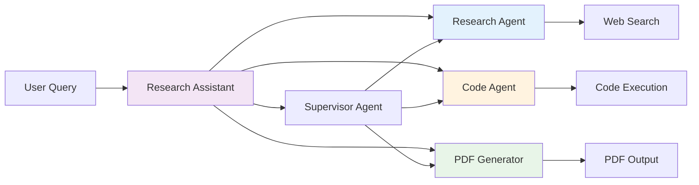

# Research Assistant Agent

**[!] THIS TOOL EXECUTES ARBITRARY CODE - USE ONLY IN SECURE, CONTROLLED ENVIRONMENTS [!]**

An AI-powered research assistant using **LangChain** and **LangGraph** frameworks to coordinate agents for research, code generation, and PDF report creation.


*Example of research workflow execution*

## 1. Important Security Notice

**THIS TOOL EXECUTES USER-SUPPLIED CODE AND CAN MODIFY SYSTEM FILES.**

- [+] Use only in isolated development environments
- [+] Never run with elevated privileges
- [+] Monitor all code execution
- [-] Do not use with untrusted inputs
- [-] Disable PythonREPLTool if code execution is not required
- [+] Always review generated code before execution

---

## 2. Key Features (Updated)

- **LangChain/LangGraph Integration**:
  - Supervisor agent coordinates task flow using state graphs
  - React-based agents for tool interaction
- **Enhanced Components**:
  - Tavily Search for web research
  - PythonREPLTool for code execution (use with caution)
  - FPDF-based PDF generation with customizable headers/footers
- **Advanced Workflow**:
  - Step-by-step evidence tracking
  - Dynamic agent routing via supervisor
  - Structured report generation with code inclusion

---

## 3. Architecture (Updated)



**Core Workflow**:
1. Supervisor coordinates agent sequence
2. Researcher performs Tavily-powered searches
3. Code agent generates/validates Python code
4. PDF agent compiles results into reports

---

## 4. Quick Start (Updated)

### Prerequisites

1. **API Keys**:
   ```bash
   export OPENAI_API_KEY=your_key
   export TAVILY_API_KEY=your_key
   ```

2. **Python Environment**:
   ```bash
   pip install fpdf langchain-experimental langchain-openai
   ```

### Basic Usage

```bash
# Run research workflow with Russian query
python src/ResearchAssistant.py "Написать исследовательский отчет о последних достижениях ИИ"

# Advanced usage with code execution
python src/ResearchAssistant.py "Исследовать квантовые вычисления и сгенерировать Python-код для симуляции"
```

---

## 5. Output Examples (New)

```text
Step 1/3: Researcher searching Tavily for "recent AI advancements"...
Found 10 sources including arxiv.org/2024.12345 and nature.com/articles/ai-breakthrough

Step 2/3: Code Agent generating analysis script:
def analyze_data(data):
    # Generated implementation with validation checks
    pass

Step 3/3: PDF Generator creating "Research_Report_2024.pdf" with 3 sections and 2 code samples
```

---

## 6. Project Structure (Updated)

```text
research-assistant/
├── src/
│   ├── ResearchAssistant.py       # Main application
├── docs/
│   └── research_workflow.png      # Workflow diagram
├── requirements.txt
└── README.md
```

---

## 7. Troubleshooting (Updated)

### Missing Dependencies

```bash
# Install PDF generation dependencies
pip install fpdf reportlab

# Verify code execution permissions
python -c "import fpdf; print(fpdf.__version__)"
```

### Code Execution Errors

```bash
# Disable code execution mode
python src/ResearchAssistant.py --no-code-execution "Research request"
```

---

## 8. Credits (Updated)

- **LangChain** - Agent coordination framework
- **LangGraph** - Workflow orchestration
- **Tavily Search API** - Web research capabilities
- **FPDF** - PDF generation library
- **OpenAI** - LLM capabilities through GPT-4.1-mini

**Note**: Generated code is provided as-is. Always validate before execution.