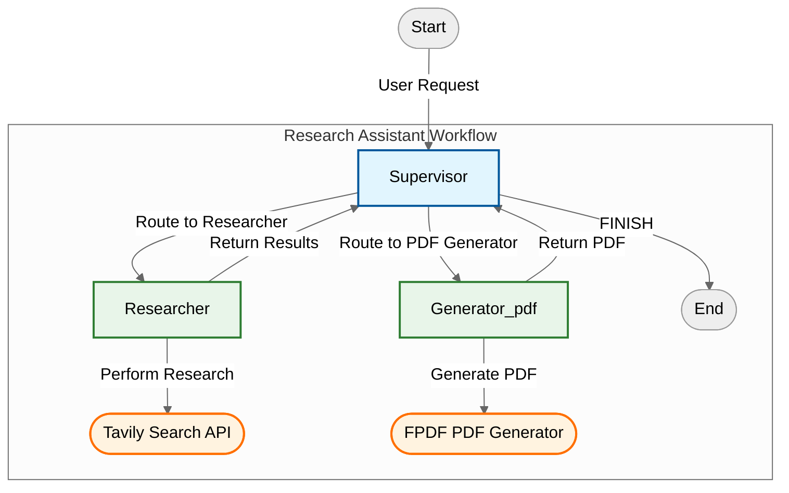

```markdown src/README.md
# Research Assistant Agent

**[!] THIS TOOL EXECUTES ARBITRARY CODE - USE ONLY IN SECURE, CONTROLLED ENVIRONMENTS [!]**

An AI-powered research assistant using **LangChain** and **LangGraph** frameworks to coordinate agents for research and PDF report creation.

---

## 1. Key Features (Updated)

- **LangChain/LangGraph Integration**:
  - Supervisor agent coordinates task flow using state graphs
  - React-based agents for tool interaction
- **Enhanced Components**:
  - Tavily Search for web research
  - FPDF-based PDF generation with customizable headers/footers
- **Advanced Workflow**:
  - Step-by-step evidence tracking
  - Dynamic agent routing via supervisor
  - Structured report generation with research summaries

---

## 2. Architecture (Updated)



**Core Workflow**:
1. Supervisor coordinates agent sequence
2. Researcher performs Tavily-powered searches
3. PDF agent compiles results into reports

---

## 4. Output Examples (Updated)

```text
Step 1/2: Researcher searching Tavily for "recent AI advancements"...
Found 8 sources including arxiv.org/2024.12345 and nature.com/articles/ai-breakthrough

Step 2/2: PDF Generator creating "Research_Report_2024.pdf" with 3 sections and 10 pages of research summary
```

---

## 5. Project Structure (Updated)

```text
research-assistant/
├── src/
│   ├── ResearchAgent.py       # Main application
├── requirements.txt
└── README.md
```

---

## 6. Troubleshooting (Updated)

### Missing Dependencies

```bash
# Install PDF generation dependencies
pip install fpdf

# Verify PDF library installation
python -c "import fpdf; print(fpdf.__version__)"
```

---

## 7. Credits (Updated)

- **LangChain** - Agent coordination framework
- **LangGraph** - Workflow orchestration
- **Tavily Search API** - Web research capabilities
- **FPDF** - PDF generation library
- **OpenAI** - LLM capabilities through GPT-4.1-mini
```

