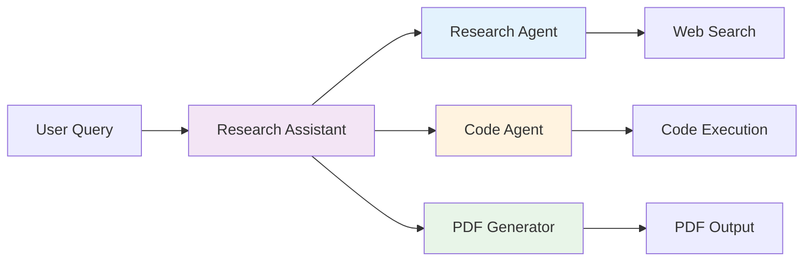
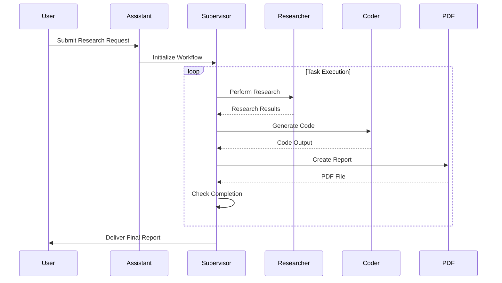

# Research Assistant Agent

**[!] THIS TOOL EXECUTES ARBITRARY CODE - USE ONLY IN SECURE, CONTROLLED ENVIRONMENTS [!]**

An AI-powered research assistant that coordinates multiple agents to conduct research, generate code, and produce PDF reports using LangGraph and LangChain frameworks.


*Example of research workflow execution*

## 1. Important Security Notice

**THIS TOOL EXECUTES USER-SUPPLIED CODE AND CAN POTENTIALLY MODIFY SYSTEM FILES.**

- [+] Use only in isolated development environments
- [+] Never run with elevated privileges
- [+] Ensure all code execution is monitored
- [-] Do not use with untrusted inputs
- [-] Disable PythonREPLTool if code execution is not required

## 2. Key Features

- **Multi-Agent Coordination**: 
  - Researcher agent for information gathering
  - Code generation capabilities
  - PDF report generation
- **Integrated Tools**:
  - Tavily Search for web research
  - Python REPL for code execution
  - PDF generation module
- **Structured Workflow**:
  - Supervisor agent coordinates task execution
  - Stateful workflow management
  - Automatic report generation
- **Transparent Execution**:
  - Step-by-step output tracking
  - Evidence collection system

## 3. Architecture

### System Architecture



**Core Components**:
- Supervisor agent manages workflow
- Research agent performs web searches
- Code agent generates executable code
- PDF generator creates final reports

### Execution Flow



**Execution Pattern**:
1. Supervisor coordinates task flow
2. Researcher gathers information
3. Coder generates executable code
4. PDF module compiles final report

## 4. Quick Start

### Prerequisites

1. **API Keys**:
   ```bash
   export OPENAI_API_KEY=your_key
   export TAVILY_API_KEY=your_key
   ```

2. **Python Environment**:
   ```bash
   python --version  # Must be 3.10+
   ```

### Installation

```bash
# Clone repository
git clone https://github.com/your/research-assistant.git
cd research-assistant

# Install dependencies
pip install -r requirements.txt
```

### Basic Usage

```bash
# Run research workflow
python src/ResearchAssistant.py "Write research report on recent AI advancements"

# Advanced usage with code generation
python src/ResearchAssistant.py "Research quantum computing and generate Python simulation code"
```

## 5. Understanding Output

### Research Workflow Output

Step 1/3: Researcher Searching Tavily for "recent AI advancements"... Found 10 relevant sources

Step 2/3: Coder Generating Python code for analysis: def analyze_data(): # Generated code implementation

Step 3/3: PDF Generator Creating report "Research Report.pdf" with 3 sections

### Evidence Collection

[*] Research Evidence: - Source 1: arxiv.org/2024.12345 - Source 2: nature.com/articles/ai-breakthrough - Generated code: analysis_script.py

## 6. Project Structure

```
research-assistant/ ├── src/ │ ├── ResearchAssistant.py # Main application │ ├── agents/ │ │ ├── research_agent.py │ │ ├── code_agent.py │ │ └── pdf_generator.py │ └── tools/ │ ├── search_tools.py │ └── code_tools.py ├── docs/ │ └── research_workflow.png ├── requirements.txt └── README.md

```

## 7. Troubleshooting

### Common Issues

#### Missing API Keys

```bash
# Set environment variables
export OPENAI_API_KEY=your_openai_key
export TAVILY_API_KEY=your_tavily_key

# Disable code execution if needed
python src/ResearchAssistant.py --no-code-execution "..."

# Install dependencies
sudo apt install python3-reportlab
```

8. License
This project is licensed under the MIT License - see the LICENSE file for details.

9. Credits

LangChain framework for agent coordination
Tavily Search API for research capabilities
fpdf library for PDF generation


**Note**: Always review generated code before execution. The PythonREPL tool executes code in the local environment.